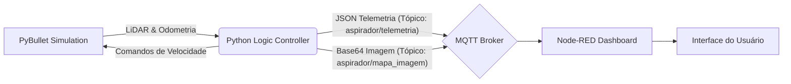

#  🤖Husky Robot Autonomous Navigation & IoT Dashboard 

> **Simulação de Robótica Móvel com Telemetria em Tempo Real via MQTT e Node-RED.**

   

## 📖 Sobre o Projeto

Este projeto consiste em uma simulação de alta fidelidade de um robô **Clearpath Husky** em um ambiente de arena com obstáculos. O robô opera de forma autônoma utilizando um algoritmo híbrido de navegação (Exploração Reativa + Planejamento de Rota) e transmite dados vitais e mapas em tempo real para um supervisório externo.

O objetivo é demonstrar a integração entre **Robótica Simulada (Digital Twin)** e **Sistemas Supervisórios IoT**, permitindo monitoramento de eficiência energética, cobertura de área e trajetória.

-----

## 🚀 Funcionalidades Principais

### 1\. Simulação & Controle (Python + PyBullet)

  * **Física Realista:** Utiliza a engine PyBullet para simular gravidade, colisão e atrito.
  * **Sensores LiDAR:** Simulação de 5 feixes de laser (Rays) para detecção de obstáculos e visualização em tempo real (linhas verdes/vermelhas).
  * **Mapeamento SLAM Simplificado:** Gera um mapa de ocupação (Grid Mapping) onde:
      * `0`: Desconhecido (Preto)
      * `50`: Área Visitada (Laranja)
      * `100`: Obstáculo/Parede (Branco Brilhante)
  * **Modo Turbo & Lógica Anti-Stuck:** O robô detecta se está preso e executa manobras de escape autônomas.
  * **Ambiente Configurável:** Geração procedural de 20 obstáculos fixos (via `seed` 42), garantindo repetibilidade nos testes.

### 2\. Comunicação & IoT (MQTT)

  * **Protocolo Leve:** Uso de MQTT para desacoplar o robô do painel.
  * **Telemetria:** Envio de dados a 50Hz (Modo, Energia, Área Coberta, Posição X/Y).
  * **Streaming de Mapa:** Geração de imagem do mapa (Matplotlib) em memória e envio via Base64 para o dashboard.

### 3\. Supervisório (Node-RED Dashboard)

  * **Rastreamento em Tempo Real (Canvas):** Desenho vetorial da trajetória do robô via HTML5 Canvas (sem delay).
  * **Visualização do Mapa de Calor:** Exibição da imagem processada do mapa com obstáculos identificados.
  * **KPIs de Performance:**
      * Consumo de Energia (Joules).
      * Evolução da área limpa/explorada (Gráfico de Linha).
      * Eficiência energética ($J/m^2$).

-----

## 🛠️ Arquitetura do Sistema



-----

## 📦 Pré-requisitos

Antes de rodar, certifique-se de ter instalado:

1.  **Python 3.8+**
2.  **Node.js & Node-RED**
3.  **Broker MQTT** (Mosquitto instalado localmente ou outro broker).

### Dependências Python

Instale as bibliotecas necessárias:

```bash
pip install pybullet numpy paho-mqtt matplotlib
```

### Dependências Node-RED

No menu do Node-RED (*Manage Palette*), instale:

  * `node-red-dashboard`

-----

## ⚙️ Instalação e Execução

### Passo 1: Configurar o Broker MQTT

Certifique-se de que o seu broker MQTT está rodando na porta `1883`.

  * *Windows:* Inicie o serviço Mosquitto.
  * *Linux:* `sudo systemctl start mosquitto`

### Passo 2: Configurar o Node-RED

1.  Abra o Node-RED (`http://localhost:1880`).
2.  Vá em **Menu** \> **Import** \> **Clipboard**.
3.  Copie o conteúdo do arquivo `flow_dashboard.json` (o JSON completo fornecido anteriormente) e cole.
4.  Clique em **Deploy**.
5.  Acesse o painel em: `http://localhost:1880/ui`

### Passo 3: Rodar a Simulação

Execute o script principal:

```bash
python robo_husky_v27.py
```

*Uma janela do PyBullet abrirá mostrando o robô, e o terminal começará a exibir logs.*

-----

## 🎮 Como Usar

### Configurações no Código (`robo.py`)

Você pode alterar constantes no início do arquivo para mudar o comportamento:

  * **`random.seed(42)`**: Mude o número para gerar uma nova disposição de obstáculos.
  * **`quantidade_obstaculos = 20`**: Aumente ou diminua a dificuldade da arena.
  * **`BASE_SPEED = 25.0`**: Ajuste a velocidade máxima do robô.

### Entendendo o Dashboard

1.  **Estatísticas:** Acompanhe se o robô está gastando muita energia para pouca área (Eficiência).
2.  **Rastreio (Esquerda):** Mostra a posição exata e instantânea do robô.
3.  **Mapa Completo (Direita):** Atualiza a cada segundo, mostrando onde o robô já "pintou" o chão e onde ele detectou paredes (pontos brancos).

-----

## 📂 Estrutura de Arquivos

```text
/roboN3
│
├── robo.py                # Código Principal (Lógica, Física e MQTT)
├── flow_dashboard.json    # Fluxo do Node-RED (Interface Gráfica)
├── mapa_v27_cheio.pkl     # Memória persistente do mapa (gerado auto.)
├── ultimo_mapa.png        # Snapshot da última execução (gerado auto.)
└── README.md              # Documentação do projeto
```

-----


**Desenvolvido com pybullet, Python e Node-red.**

** MARIA JÚLIA **

